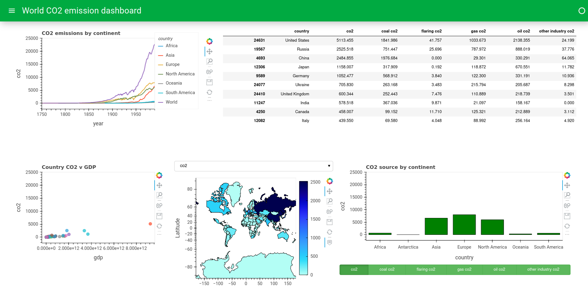

# CO2 Dashboard
## Introduction

This is a dashboard based on the CO2 emissions for each country and continent over time. The dataset can be found at https://ourworldindata.org/co2-emissions

I have constructed this dashboard to help understand what can be created using the holoviz libraries:  
    * Panel
    * hvPlot
    * geoView

I find these libraries great to create interactive visualisations within Jupyter Notebook, allowing for a better exloration and understanding of the data with minimal coding. Any panel that are created can be quickly added to dashboards, allowing customers to see and interact with the data without needing any coding knowledge.

'How-to' guides have been added the holoviz folder for some of the more complex visulaisations that I had trouble creating, hopefully it will help others to understand how they work.
